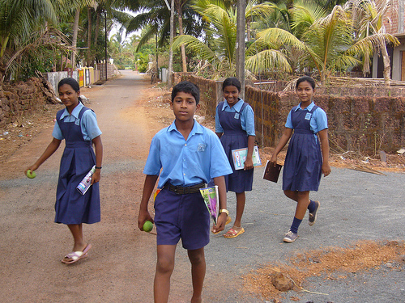
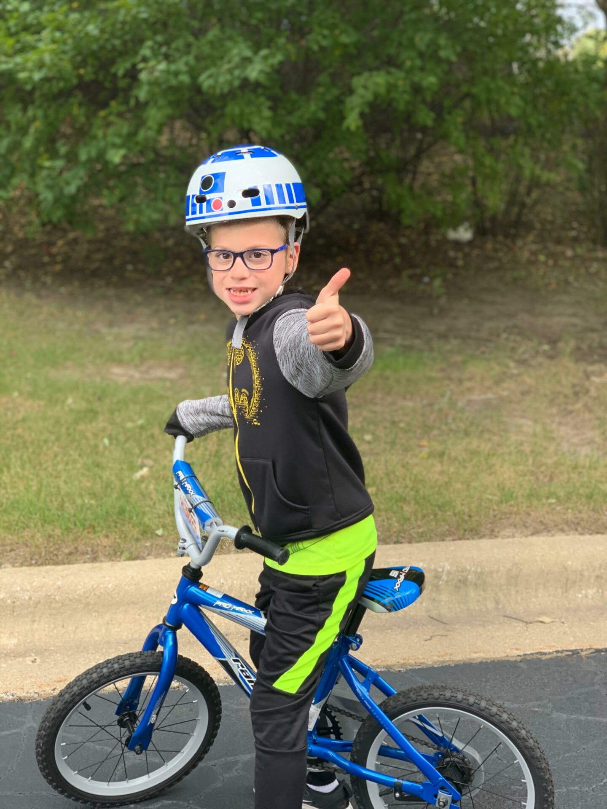

# ImageCaptioning
Implementation of deep learning model that generates descriptive caption for an image.

This repository contains the code for the image captioning with attention model as described in the paper - [Show, Attend and Tell](https://arxiv.org/abs/1502.03044).

This holds great significance for me personally, as it took nearly a year of effort to reach a state of near-completion.

## Model Architecture
Here's an overview of the model architecture and other details:

1. __Encoder (CNN):__ The first part of the model is an encoder that uses a CNN to extract features from the input image. In particular, a ___pre-trained ResNet101___ is typically used as the encoder, with the final fully connected layer removed.

2. __Decoder (RNN):__ The second part of the model is a decoder that uses an RNN to generate a sequence of words to form a caption. Specifically, a type of RNN called Long Short-Term Memory (LSTM) has been used as the decoder.

3. __Attention Mechanism:__ The attention mechanism is a key component of the model that allows the decoder to selectively focus on different parts of the input image at each time step. The attention mechanism calculates a set of attention weights that determine which parts of the image are most relevant to generating the next word in the caption. The attention weights are calculated using a combination of the previous hidden state of the decoder and the encoded image features. I have only implemented soft attention in this repository.

4. __Training:__ The model is trained using a technique called __Teacher Forcing__. Teacher Forcing is a training technique used in sequence-to-sequence models where the model is trained to predict the next word in a sequence given the previous words. During training, the ground-truth words are fed as inputs to the model, rather than the model's own predictions. This helps to stabilize the training process and improve the accuracy of the model's predictions during inference.

5. __Loss Function__: <br>
    5.1. __Language Model Component__ - This component is typically calculated using the cross-entropy loss, which measures the dissimilarity between the predicted probability distribution over the vocabulary of words and the ground-truth probability distribution over the vocabulary of words at each time step. <br>
    5.2. __Doubly Stochastic Regularization__ - This component encourages the model to pay equal attention to every part of the image by adding a component where we add (1 - (sum of pixel weights for a given pixel over all timesteps)) over all pixels.

6. __Beam Search__: Beam search is a heuristic search algorithm which can be used to generate captions for a given image during inference. It works by maintaining a set of ```k``` partial captions, where ```k``` is the beam size, and expanding each partial caption by appending the top ```k``` words with the highest predicted probabilities at each time step. The score of each partial caption is calculated as the sum of the logarithms of the predicted probabilities of the words in the caption. At each time step, the beam search algorithm selects the ```k``` partial captions with the highest scores and expands them. The algorithm continues to expand partial captions until a specified maximum caption length is reached, or until all partial captions reach an end-of-sequence token. The final caption is the caption with the highest score among our final ```k``` captions. Beam search can help to improve the quality of the generated captions by exploring multiple possible caption sequences and selecting the most likely one based on the predicted probabilities of the words in the captions.

## Implementation Details

Before starting, an anaconda environment can be created using the ```imcap.yml``` provided. This can be done by running the command ```conda env create -f imcap.yml```.

1. As the smallest dataset available, I opted to use the Flickr8k dataset and utilized Andrej Karpathy's train-validation-test splits. To create the processed dataset, I downloaded all raw data files and placed them in the appropriate directories as instructed in the README files provided inside directories. ```fraction``` is another variable which should be in the range (0,1] indicating the fraction of dataset we plan on using (I used 0.01 and 0.05 for debugging). Once you have all raw data in place, run ```python make_dataset.py``` in the root direcrtory and it would generate the final processed data.

2. Next to train the model, all hyperparameters can be changed at the start of ```train.py```. This file is dependent on ```pytorch_dataset_class.py``` which contains the pytorch ```Dataset``` class wrapper for our data and ```all_models.py``` which contains the model class definitions. I was using M2 MacBook air for this repository which means that using ```device = 'mps'``` was a natural choice for me. However, due to unknown reasons (pytorch is still buggy for MPS), the losss value increases when I do so. However when I run the same code with ```device = 'cpu'``` instead, the loss function decreases and gives acceptable results. I never ran the code for more than 5 epochs as running on CPU is hard. The best model (according to BLEU score) is saved in the ```model_files``` directory.

3. To generate captions for a given image, we can run ```python inference.py``` by making sure that all parameters are correct inside the file. It would would run both plain inference and inference with beam search. I have provided outputs for two sample images which I felt were satisfactory given that the model was only trained for 5 epochs.

___________________________________________________________________________
 <br>
Caption without beam search: a group of people stand in front of a building <br>
Caption with beam search (beam_size = 5):  a group of people walking down the street
___________________________________________________________________________
 <br>
Caption without beam search: a boy in a helmet rides a bike <br>
Caption with beam search (beam_size = 5):  a young boy wearing a helmet rides a bike
___________________________________________________________________________
 <br>
Caption without beam search: a boy in a swimming pool <br>
Caption with beam search (beam_size = 5):  a boy swimming in a pool
___________________________________________________________________________